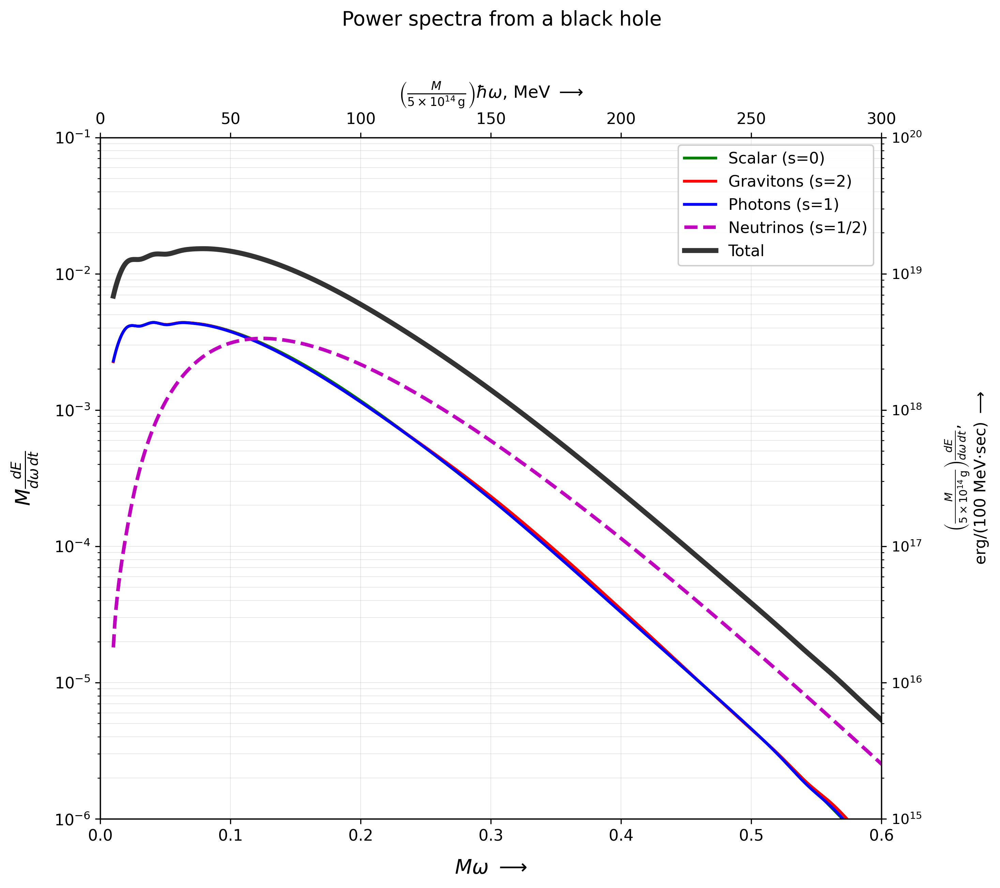

# Master Thesis: Black Hole Physics Simulations

This repository contains the computational implementation of my master thesis work on black hole physics, focusing on Hawking radiation, the Page curve, and solutions to the Teukolsky equation.

## Overview

This project provides numerical simulations and computational tools for studying:
- **Hawking Radiation**: Calculation of thermal emission from black holes
- **Teukolsky Equation**: Solutions for perturbations in Kerr black hole spacetimes

## Project Structure

### `/hawkingPage`
Hawking radiation spectra calculations for black hole evaporation.

Computes thermal emission spectra for:
- Scalar fields (spin-0)
- Photons (spin-1)
- Gravitons (spin-2)
- Neutrinos (spin-1/2, fermions)



*Hawking radiation power spectra*

**See [hawkingPage/README.md](hawkingPage/README.md) for detailed build and run instructions.**


### `/teukolskyEquation`
Numerical solutions to the Teukolsky equation:
- `teukolsky1D.cpp`: 1D radial equation solver
- `teukolsky2D.cpp`: 2D time-evolution solver
- `visualize.py`: Visualization tools for solution data
- `/data`: Time-series solution snapshots

## Dependencies

- **C++ Compiler**: C++11 or later
- **CMake**: Version 3.10+
- **Eigen3**: Linear algebra library
- **Python 3**: For visualization scripts
- **NumPy/Matplotlib**: Python plotting dependencies

## Building the Project

```bash
# Clone the repository
git clone https://github.com/QED137/MasterThesis.git
cd MasterThesis

# Build Page curve / Hawking spectrum code
cd hawkingPage
mkdir -p build && cd build
cmake ..
make -j

# Build Teukolsky equation solvers
cd ../../teukolskyEquation
g++ -std=c++11 -O3 teukolsky1D.cpp -o teukolsky1D
g++ -std=c++11 -O3 teukolsky2D.cpp -o teukolsky2D
```

## Usage

### Hawking Radiation Simulations
See detailed instructions in [hawkingPage/README.md](hawkingPage/README.md)

Quick start:
```bash
cd hawkingPage/build
./bin/hawking_radiation all           # Compute all particle spectra
python3 interpolation_spectra.py      # Create smooth interpolated data
python3 plot_page_1976_exact.py page  # Generate Page (1976) style plots
```

### Teukolsky Equation Solver
```bash
# Solve Teukolsky equation
cd ../../teukolskyEquation
./teukolsky1D
./teukolsky2D

# Visualize Teukolsky solutions
python3 visualize.py
```

## Future Development

The goal is to develop this into a full interactive browser-based visualization tool using modern web frameworks, allowing real-time exploration of black hole physics simulations.

## License

See [LICENSE](LICENSE) for details.

## Contact

For questions or collaboration, please open an issue on this repository.
